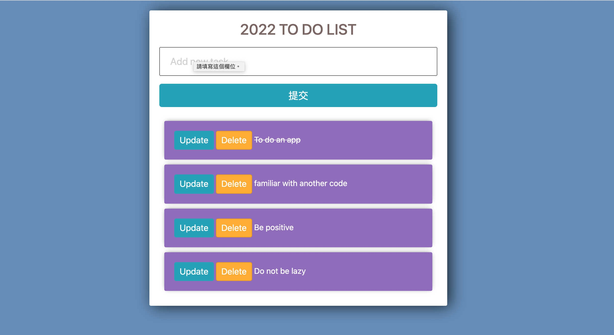

# django_to_do_app

# Project Title

2022 to do list.

## Description

Simple to add, update, delete and cross out complete items.


## Getting Started

### Dependencies

* css bootstrap

### Installing

* How/where to download your program
* Any modifications needed to be made to files/folders

### Executing program

* How to run the program
* Step-by-step bullets
```
    Create project
    Migrate database & create user
    Create app
    URL Routing
    Templates
    Create Model (Task)
    Render data (Tasks) in template
    Model Form
    Create Item
    Update Item
    Delete Item
    Cross out complete items
    Style template
```

## Help

Any advise for common problems or issues.
```
python manage.py runserver
python manage.py createsuperuser
```

## Authors

Elsie Lin


## Version History

* 0.2
    * Various bug fixes and optimizations
    * See [commit change]() or See [release history]()
* 0.1
    * Initial Release

## License

This project is licensed under the [NAME HERE] License - see the LICENSE.md file for details

## Acknowledgments

Inspiration, code snippets, etc.
* [Source Code](https://github.com/divanov11/to-do-app)
* [document](https://docs.google.com/document/d/1eu_ImYL21W905howHsyW782BPxKVJp9vz5nlJYB2G2E/edit)
* [youtube](https://www.youtube.com/watch?v=4RWFvXDUmjo)