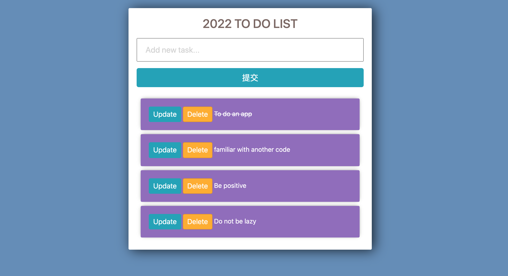

# django_to_do_app

# Project Title

2022 to do list.

## Description

Simple to add, update, delete and cross out complete items.


## Getting Started

### Dependencies

* Django
* CSS bootstrap

### Installing

* pip install django

### Executing program

* How to run the program
* Step-by-step bullets
```
    $ cd django_to_do_app
    $ python3 -m venv venv 
    $ source venv/bin/activate 
    $ python manage.py runserver
    $ python manage.py createsuperuser
```

## Help

## Authors

Elsie Lin


## Version History

* 0.1
    * Initial Release

## License

## Acknowledgments

Inspiration, code snippets, etc.
* [Source Code](https://github.com/divanov11/to-do-app)
* [document](https://docs.google.com/document/d/1eu_ImYL21W905howHsyW782BPxKVJp9vz5nlJYB2G2E/edit)
* [youtube](https://www.youtube.com/watch?v=4RWFvXDUmjo)